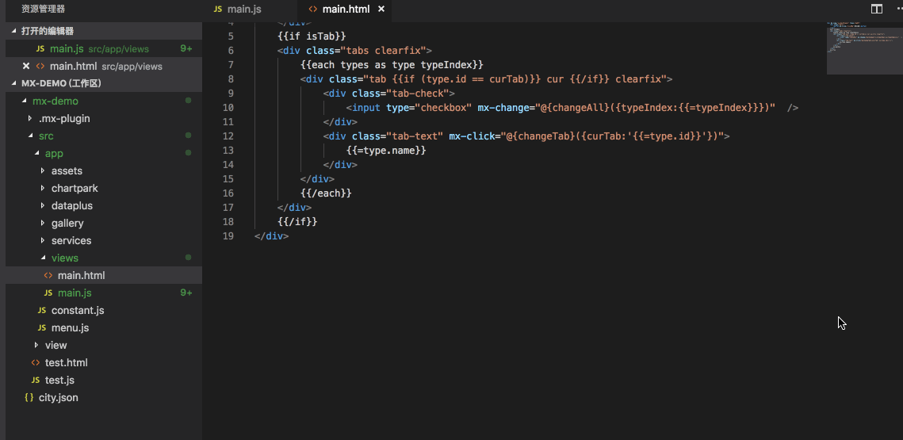
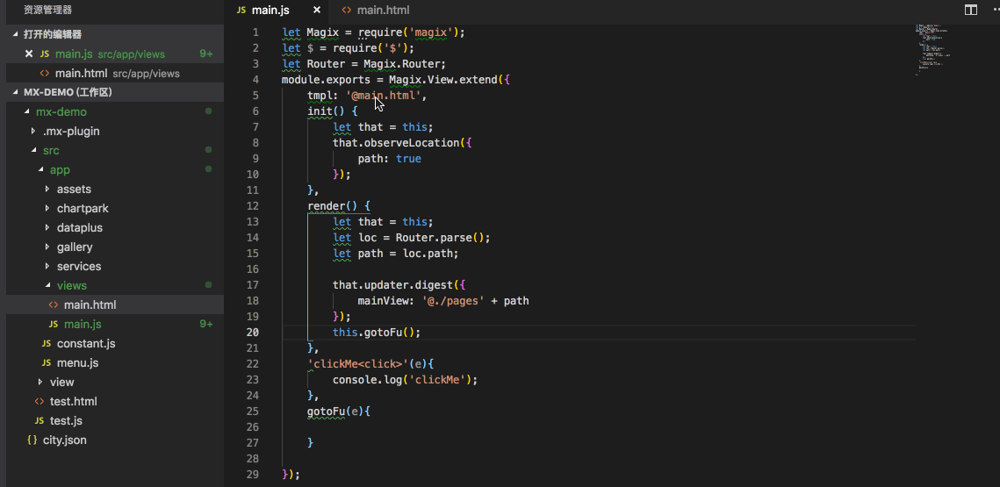
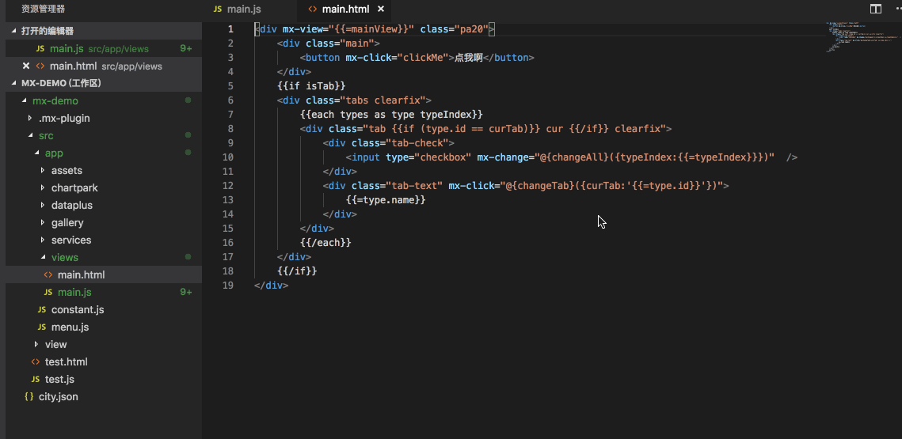
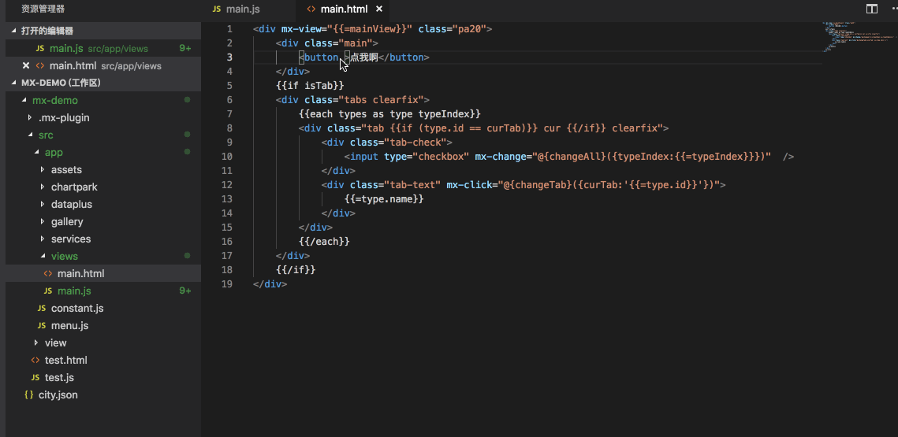
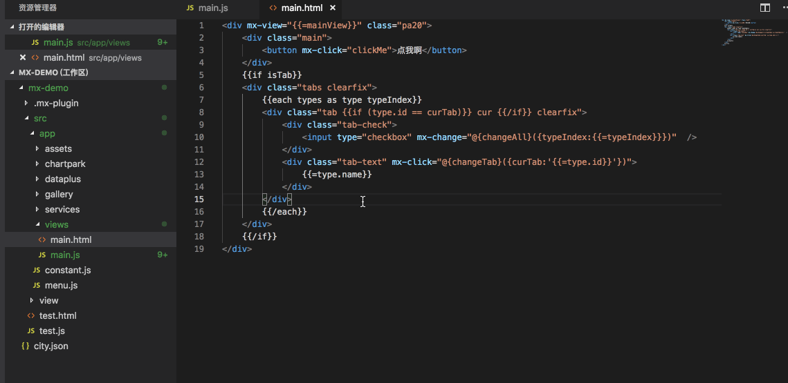

# Magix 辅助开发插件

## 功能

### html模板页与js页跳转

通过快捷键`Alt+Tab`、`MAC键+鼠标点击 Magix tmpl属性值`、`右键快捷方式`，支持 html模板页与之相关联的js页跳转:





注意：由于跳转功能是基于 magix3的js/ts写法的语法分析，仅支持下面写法的跳转功能,特殊项目可联系@灼日@抱血添加适配

```javascript
  var Magix = require('magix');
  module.exports = Magix.View.extend(
    temp:'@index.html',
    init:function(){},
    render:function(){}
  );
```
### html mx-前缀函数跳转至定义

通过快捷键`MAC键+鼠标点击`，支持 html模板页函数跳转到与之相关联的js定义:



### html magix mx-事件提示 




### Diamond 快速打开


### html 模板代码折叠




## 加群有惊喜


1. **locally:** add `.vscode/settings.json` to your project's `.git/info/exclude` file

    _or_

2.  **globally:** create and use a global `.gitignore_global` file like so:

    ```git config --global core.excludesfile ~/.gitignore_global```

## Usage

Colors do not get overwritten.  This allows you to set custom colors (or a single Base Color).  To switch between light and dark themed colors, you must first delete the current colors from `.vscode/settings.json`.  You can do this manually or by or selecting `remove` in the extension's `Window Colors: Theme` settings and reloading the VS Code window.

<!--  -->

## Notes

Workspaces containing multiple root folders are not currently supported by this extension.  The current behavior for multi-folder workspaces is that the workspace color settings will be set by the first window opened, and can be saved in the workspace's `<workspace-name>.code-workspace` configuration file.

When opening new VSCode windows, you might see the relevant theme colors change as they are updated to the new workspace.  This is normal:


## Credits

Hashing and color generation functions adapted from https://www.designedbyaturtle.co.uk/convert-string-to-hexidecimal-colour-with-javascript-vanilla/ by Edd Turtle.

Workspace root folder detection function adapted from https://itnext.io/how-to-make-a-visual-studio-code-extension-77085dce7d82 by Van Huynh.


<br><br>


### 0.0.8

完成哈哈功能

### 1.0.1

Fixed issue #.

### 1.1.0

Added features X, Y, and Z.

-----------------------------------------------------------------------------------------------------------


